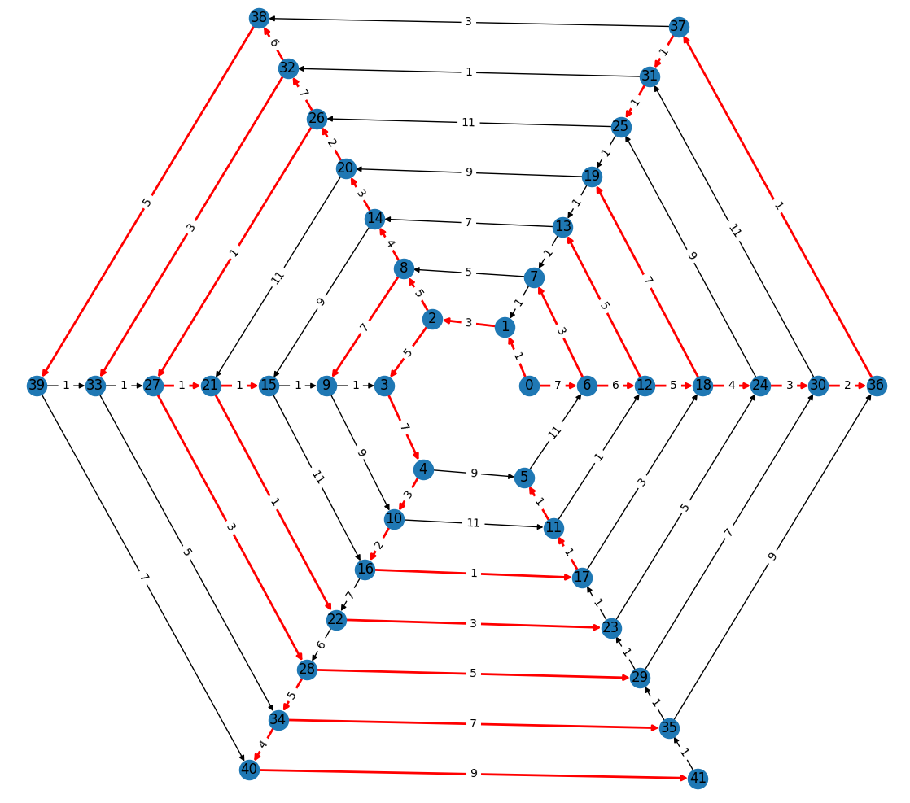

NoGraphs: Graph analysis on the fly
===================================

.. toctree::
   :maxdepth: 5
   :includehidden:
   :hidden:

   Overview <self>
   installation
   concept_and_examples
   graphs_and_adaptation
   graph_operations
   traversals
   bidirectional_search
   reduction_of_other_problems
   vertex_identity
   gears
   gadgets
   performance
   api.rst
   api_extras.rst
   genindex
   changelog

NoGraphs simplifies the analysis of graphs that can not or should not be fully
computed, stored or adapted, e.g. infinite graphs, large graphs and graphs with
expensive computations.
(Here, the word *graph* denotes the
`thing with vertices and edges <https://en.wikipedia.org/wiki/Glossary_of_graph_theory>`_,
not with diagrams.)

The `approach <concept_and_examples>`: Graphs are
**computed and/or adapted in application code on the fly**
(when needed and as far as needed). Also,
**the analysis and the reporting of results by the library happens on the fly**
(when, and as far as, results can already be derived).

Think of it as *graph analysis - the lazy (evaluation) way*.

**Documentation**

- `Installation guide <installation>`
- `Tutorial <concept_and_examples>` (contains many `examples <examples>`)
- `API reference <api>`

**Feature overview**

- `Unidirectional traversal algorithms <traversals>`: DFS, BFS, topological search,
  Dijkstra, A\* and MST.
- `Bidirectional search algorithms <bidirectional_search>`: BFS and Dijkstra.
- Results: `Reachability, depth, distance, paths and trees <traversals>`.
  `Paths <paths_api>` can be
  `calculated with vertices, edges, or attributed edges <general-start_from>`,
  and can be iterated in both directions.
- Flexible graph notion:

  - Infinite directed multigraphs with loops and
    attributes (this includes
    `multiple adjacency, cycles, self-loops <supported-special-cases>`,
    `directed edges <graphs_without_attributes>`,
    `weighted edges and attributed edges <graphs_with_attributes>`).
  - Infinite graphs are supported, but need to be
    locally finite (i.e., a vertex has only finitely many outgoing edges).

- Generic API:

  - `Vertices <vertices>`: Can be anything except for None. Hashable vertices can be
    used directly, unhashable vertices can be used together with
    `hashable identifiers <vertex_identity>`.
  - `Edge weights and distances <weights>`: Wide range of data types
    supported (float, int, Decimal, mpmath.mpf and others), e.g.,
    for high precision computations.
  - `Edge attributes <graphs_with_attributes>`: Any object, e.g, a container
    with further data.
  - `Identity and equivalence of vertices <vertex_identity>` can be
    chosen / defined.
  - Bookkeeping: `Several sets of bookkeeping data structures <replace-internals>`
    are predefined, optimized for different situations (data types used by the
    application, hashing vs. indexing, collections for *Python* objects or *C* native
    data types,...); `Adaptable and extendable <new_gear>`, e.g., specialized
    collections of 3rd party libraries can be integrated easily and runtime
    efficiently.

- Flexible API: The concept of implicit graphs that NoGraphs is based on
  allows for an API that eases
  `graph operations <graph_operations>` like
  graph pruning, graph abstraction, and the typical binary
  graph operations (union, intersection, several types of products), the
  computation of `search-aware graphs <search_aware_graphs>`, the combination of
  `problem reduction with lazy evaluation <reduction_of_other_problems>`,
  and `traversals of vertex equivalence classes on the fly <vertex_identity>`.
  Bookkeeping data can be
  `pre-initialized and accessed during computations <initializing_bookkeeping>`.
- Typing: The API `can be used fully typed <typing>` (optionally).
- Implementation: Pure Python (>=3.9). It introduces no further dependencies.
- CI tests: For all supported versions of Python and both supported interpreters
  CPython and PyPy, both code and docs, 100% code coverage.
- Runtime and memory performance: Have been goals (CPython). In its domain, it often
  even `outperforms <performance>` *Rust*- and *C*-based libraries.
  Using PyPy `improves its performance further <performance-pypy>`.
- Source: Available `here <https://github.com/HeWeMel/nographs>`__.
- Licence: `MIT <https://github.com/HeWeMel/nographs/blob/main/LICENSE>`__.

**Extras** (outside of the core of NoGraphs)

- Computation of exact solutions for (small)
  `traveling salesman problems <tsp_in_nographs>` (shortest / longest route,
  positive / zero / negative edge weights, graph does not need to be complete).
- Dijkstra shortest paths algorithm for
  `infinitely branching graphs with locally sorted edges <infinite_branching>`.
- `Gadget functions <gadgets>` for test purposes. They make the easy task of
  adapting existing explicit test graphs a no brainer, may they be
  stored in `edge indices or edge iterables <edge_gadgets>`
  or in `arrays <matrix_gadgets>`.

.. _overview_example:

**Example**

Our graph is directed, weighted and has infinitely many edges. These edges are
defined in application code by the following function. For a vertex *i*
(here: an integer) as the first of two
parameters, it yields the edges that start at *i* as tuples
*(end_vertex, edge_weight)*. What a strange graph - we do not know how it
looks like...

.. code-block:: python

    >>> def next_edges(i, _):
    ...     j = (i + i // 6) % 6
    ...     yield i + 1, j * 2 + 1
    ...     if i % 2 == 0:
    ...         yield i + 6, 7 - j
    ...     elif i % 1200000 > 5:
    ...         yield i - 6, 1

We would like to find out the *distance* of vertex 5 from vertex 0, i.e., the minimal
necessary sum of edge weights of any path from 0 to 5, and (one of) the *shortest
paths* from 0 to 5.

We do not know which part of the graph is necessary to look at in order to find the
shortest path and to make sure, it is really the shortest. So, we use the
traversal strategy *TraversalShortestPaths* of NoGraphs (see
`Traversal algorithms <traversals>`). It implements the well-known *Dijkstra*
graph algorithm in the lazy evaluation style of NoGraphs.

.. code-block:: python

    >>> import nographs as nog
    >>> traversal = nog.TraversalShortestPaths(next_edges)

We ask NoGraphs to traverse the graph starting at vertex 0, to calculate paths
while doing so, and to stop when visiting vertex 5.

.. code-block:: python

    >>> traversal.start_from(0, build_paths=True).go_to(5)
    5

The state data of this vertex visit contains our result:

.. code-block:: python

    >>> traversal.distance
    24
    >>> traversal.paths[5]
    (0, 1, 2, 3, 4, 10, 16, 17, 11, 5)

We learn that we need to examine the graph at least till vertex 17 to find the
shortest path from 0 to 5. It is not easy to see that from the definition
of the graph...

A part of the graph, the vertices up to 41, is shown in the following picture.
Arrows denote directed edges. The edges in red show shortest paths from
0 to other vertices.

**And now?**

Can you imagine...

- An infinite generator of primes, defined by just a graph and
  a call to a standard graph algorithm?
- Or a graph that defines an infinite set
  of Towers of Hanoi problems in a generic way, without fixing the number of
  towers, disk sizes, and the start and goal configuration - and a specific
  problem instance is solved by just one library call?
- Or a way for computing an exact solution for traveling salesman problems,
  that is based on just a graph and a call of the Dijkstra single source shortest path
  algorithm?
- Or graphs that are dynamically
  computed based on other graphs, or on analysis results about other graphs,
  or even on partial analysis results for already processed parts of the same graph?

Let's `build it <installation>`.

Welcome to NoGraphs!
